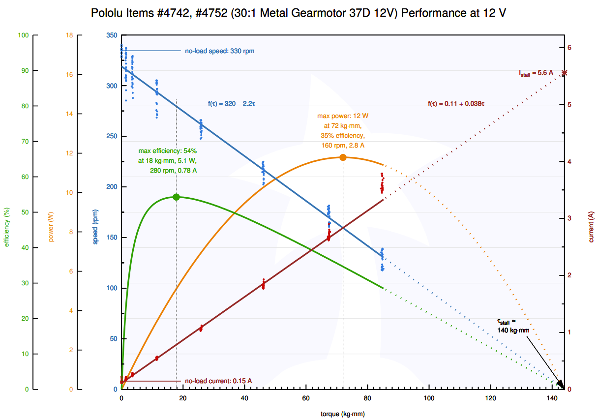
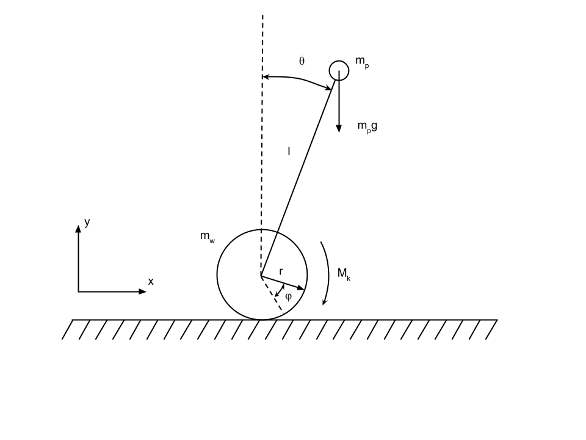

##### DC motor
###### formulas

$$ 
U-E=R_mI+L_m\frac{dI}{dt}
\tag{1.1}
$$
U - motor voltage
E - voltage created by motor
$R_m$ - motor resistance
$I$ - current
$$
E=K_e\omega_m
\tag{1.2}
$$
$\omega_m$ - angular velocity of the motor
$K_e$ hopefully a constant
$$
M=K_m(I-I_0)
\tag{1.3}
$$
$M$ - moment from the motor
$K_m$ - hopefully a constant
$I_0$ - no-load current (0.15A)

In case $L_m\approx0$, 
$$
M=\frac{K_m}{R_m}(U - K_e\omega)
\tag{1.4}
$$
$$
U=\frac{R_m}{K_m}M+K_e\omega
\tag{1.5}
$$

###### Motor parameters (from the plot)

from the specs of the motor : https://www.pololu.com/product/4691/specs
https://www.pololu.com/file/0J1736/pololu-37d-metal-gearmotors-rev-1-2.pdf

$I_0$ - no-load current 0.15A
$K_m\approx0.03$
$K_e\approx0.34$
$R_m\approx2.18$ Om

##### pendulum
some of the info is taken from http://spin7ion.ru/ru/blog/balancerBuildSteps

lets consider "flat" (2D) model.

$m_p$ robot mass (without wheels)
$m_w$ mass of the wheels
$l$ length (height?) 
$r$ wheel radius
$\theta$ angle between vertical and pendulum
$\varphi$ wheel rotation angle
$M$ DC motor moment
$w=w_p=\.\theta$ some (part of the) rotation rate from the IMU
$w_w=\.\varphi$ wheel rotation rate

wheel center
$$ x = r\varphi \\ y = r $$
$x, y$ coordinates of the center of the wheel.

$x_p, y_p$ - coordinates of the "upper point":
$$  x_p=x+lsin(\theta) \\ y_p=r+lcos(\theta) $$

Kinematic energy of the whole system:

$$T=T_w+T_p$$
$$T_w=\frac{m_wV_w^2}{2}+\frac{I_ww_w^2}{2}=\frac{m_w w_w^2}{2}(r^2+r_i^2)$$

$V_w=\.x$  velocity of the wheel
$I_w$ wheel moment of inertia

$I_w=\sum m_ir_i^2$, for the ring it will be $I_w=m_wr_i^2$

In our case, $r_i$ is some radius, probably $r_i > r$ (?). And there is a motor with a gearbox attached, BTW. We can try to estimate $I_w$, if we measure the motor current.

If $\theta$ is small, then $sin(\theta)\approx0$ and formula is simple:
$$T_p=\frac{m_pV_p^2}{2}\approx\frac{m_p}{2}(rw_w+lw_p)^2$$

In case we have a noticiable $\theta$:
$$T_p=\frac{m_p}{2}(\.y_p^2+\.x_p^2)=\frac{m_p}{2}(l^2sin^2(\theta)w_p^2+(rw_w+lcos(\theta)w_p)^2)$$
$$T_p=\frac{m_p}{2}(l^2sin^2(\theta)w_p^2+r^2w_w^2+l^2cos^2(\theta)w_p^2+2rlw_ww_pcos(\theta))$$

$$T_p=\frac{m_p}{2}(l^2w_p^2+  r^2w_w^2+2rlw_ww_pcos(\theta))$$
which is just a little bit smaller then in "simple case".

"full" kinetic energy:
$$T=\frac{m_w w_w^2}{2}(r^2+r_i^2)+\frac{m_p}{2}(l^2w_p^2+  r^2w_w^2+2rlw_ww_pcos(\theta))$$

coordinates:
$$q=\begin{pmatrix}  \varphi \\ \theta \end{pmatrix}$$

$$\frac{\delta T}{\delta  \varphi}=0$$
$$\frac{\delta T}{\delta \.\varphi}=\frac{\delta T}{\delta w_w}=(m_w(r^2+r_i^2)+m_pr^2)w_w+m_prlw_pcos(\theta)$$

$$\frac{d}{dt}\frac{\delta T}{\delta \.\varphi}=(m_w(r^2+r_i^2)+m_pr^2)\varepsilon_w+m_prl(\varepsilon_pcos(\theta)-w_p^2sin(\theta))$$

$$\frac{\delta T}{\delta \theta}=-m_prlw_ww_psin(\theta)$$

$$(w_ww_p)'_t=\varepsilon_ww_p + \varepsilon_pw_w$$
$$((w_ww_p)sin(\theta))'_t=(\varepsilon_ww_p + \varepsilon_pw_w)sin(\theta)+w_ww_p^2cos(\theta)$$
$$\frac{d}{dt}\frac{\delta T}{\delta \theta}=-m_prl((\varepsilon_ww_p + \varepsilon_pw_w)sin(\theta)+w_ww_p^2cos(\theta))$$

forces:
$$\delta s_1=r\varphi$$
$$\delta A_1=P_1\delta \varphi$$
$$P_1=M$$

the motion eq:
$$ M=rlm_pcos(\theta)\.\omega+r^2(m_p+2m_w)\.\omega_w-rlm_psin(\theta)\theta^2  $$

